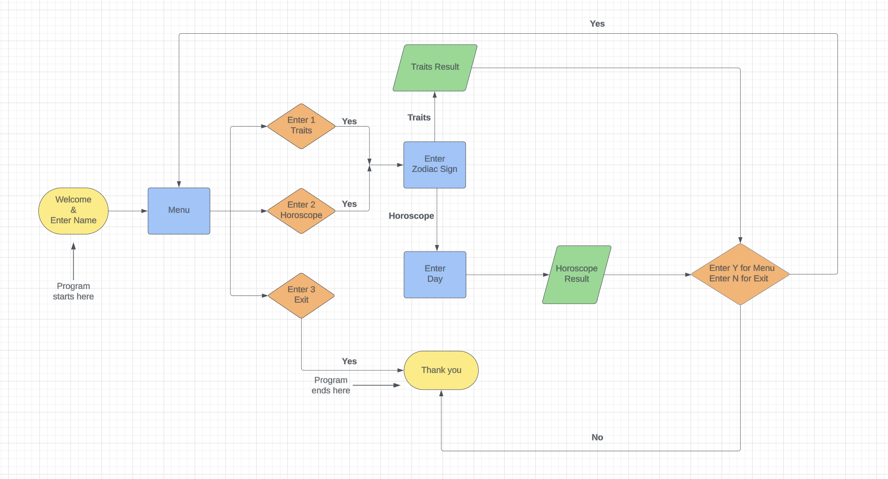

# YOUR HOROSCOPE
This application is designed to provide users with insightful zodiac traits and daily horoscopes based on their chosen zodiac sign and day.

The link to the live version of the project can be found [HERE](https://your-horoscope-c561ace553fc.herokuapp.com/)

## Tabel of Contents
+ [User Experience](#user-experience "User Experience")
+ [Design](#design "Design")
+ [Features](#features "Features")
+ [Testing](#testing "Testing")
+ [Technologies Used](#technologies-used "Technologies Used")
+ [Deployment](#deployment "Deployment")
+ [Credits](#credits "Credits")
 
## User Experience

### First time player:

- As a first-time user, I want to be able to determine my zodiac sign based on my month of birth. So that I can engage with content that is relevant to me without prior knowledge of astrology. 
- As a first-time user, I want to choose my zodiac sign from a list. So that I can see specific insights related to my sign.
- As a first-time user, I want the app to be colorful, have images, animations and engaging. So that my experience learning about my zodiac traits is fun and visually appealing.
- As a first-time user, I want to choose the day for which I want to know my horoscope. So that I can get insights for specific days, past, present or future.
- As a first-time user, I want easy options to navigate back or exit the app. So that I can have a smooth user experience without feeling stuck in any part of the app.
- As a first-time user, I want to see an attractive logo when I open the app. So that I can easily recognize and remember the app.
- As a first-times user, I would like a personalized feel of my name being used inside the application.
- As a first-times user, I would like a simple and clear options to enhance usability and reduce confusion.
- As a first time user, I would like to see some confirmation if I have successfully exited out of the application.
- As a first time user I would like clear instructions and feedback to rectify if I make any mistake.

### Frequent Player:

- As a frequent user, I want the horoscopes to be updated daily. So that I can rely on the app for fresh and relevant astrological insights every day.
- As a frequent user, I want to check not only my horoscope but also those of my friends and family without restrictions. So that I can share and discuss these insights with them.
- As a frequent user, I want the process of selecting zodiac signs and fetching results to be quick and simple. So that I can enjoy a seamless experience without unnecessary delays.
- As a frequent user, I want to see some animations while waiting for results. So that the waiting time is more enjoyable and the app feels lively.
- As a frequent user, I want to create a profile where I can save my zodiac sign and view past results. So that I can have a personalized experience and easily access historical datas.

## Design

### Flowchart:

I made a flowchart for the project to plan out my code structure using [Lucid](https://rb.gy/7i0nms)

## Features

### Existing Features

#### Landing Page:

##### Objective:

Welcome the user to the application and collect their name for a personalized experience.

##### Design Elements:

- Logo: Placed prominently at the top, the logo serves as a visual anchor and brand identifier, ensuring it's memorable and recognizable.
- Welcome Message: A friendly and inviting message that greets users and sets a warm tone for their interaction with the application.
- Name Input: A text box prompts users to enter their name, allowing for personalization of the experience. This is optional, and users can press enter to proceed anonymously if they prefer privacy.

##### User Flow:

- User sees the logo and reads the welcome message.
- User is prompted to enter their name for a personalized experience or can choose to proceed without doing so by pressing enter.
- Upon submission, the user is redirected to the Menu Page.

> - As a first-time user, I want to see an attractive logo when I open the app. So that I can easily recognize and remember the app.
> - As a first-times user, I would like a personalized feel of my name being used inside the application.

#### Menu Page:

##### Objective: 

Provide navigational choices to the user for exploring different features of the application.

##### Design Elements:

- Logo: Continuity is maintained with the logo positioned at the top of the page.
- Personalized Greeting: A "Hello" message that includes the user's name (if provided) to reinforce personalization.
- Menu Options: Clearly numbered options guide the user to their next activity: 
Enter 1 to know your traits. 
Enter 2 to know your daily horoscope. 
Enter 3 to exit. 

##### User Flow:

- User is greeted by name (if provided) and sees the menu options.
- User selects an option by entering the corresponding number.
- The application directs the user to the appropriate page based on their selection.

> - As a first-times user, I would like a simple and clear options to enhance usability and reduce confusion.

#### Zodiac Signs Page: 

##### Objective: 

Assist users in identifying their zodiac sign based on their birth date.

##### Design Elements:

- List of Zodiac Signs: Each zodiac sign is listed alongside its corresponding date range in brackets, aiding users who are unfamiliar with zodiac periods.
- Instructional Prompt: Users are guided on how to select their zodiac sign, enhancing usability.

##### User Flow:

- User is presented with a list of zodiac signs and corresponding date ranges.
- User identifies and enters the number corresponded to their zodiac sign based on their birth date.
- Depending on their previous menu selection:
  - If option 1 was selected, the user is directed to a page detailing the traits of their chosen zodiac sign.
  - If option 2 was selected, the user is directed to a page where the user has to select for which day they want to know thier horoscope.

> - As a first-time user, I want to be able to determine my zodiac sign based on my month of birth. So that I can engage with content that is relevant to me without prior knowledge of astrology. 
> - As a first-time user, I want to choose my zodiac sign from a list. So that I can see specific insights related to my sign.
> - As a frequent user, I want the process of selecting zodiac signs and fetching results to be quick and simple. So that I can enjoy a seamless experience without unnecessary delays.

#### Zodiac's Traits Result Page:

##### Objective: 

Display detailed traits of the selected zodiac sign in an engaging and visually appealing format.

##### Design Elements:

- Zodiac Symbol Image: Prominently displays an artistic or symbolic representation of the chosen zodiac sign at the top of the page. This visual serves not only as an attractive feature but also helps reinforce the identity of the sign.
- Zodiac Name: The name of the zodiac sign is displayed next to the image, serving as a clear identifier and header for the information that follows.
- Traits List: Traits of the zodiac sign are presented in a list format. The traits begin with the starting letter of the zodiac's name, adding a creative and thematic touch to the content presentation.
- Colorful Design: The page uses colors that are associated with or complement the zodiac sign, enhancing visual engagement and making the information more appealing.
- Navigation Options: At the bottom of the page, users are provided with options to navigate back to the menu or exit the application. The options are clearly labeled "Enter Y to return to the menu" and "Enter N to exit."

##### User Flow:

- After selecting their zodiac sign on the previous page, the user is directed to the Zodiac Traits Result Page.
- The user is greeted by an image of their zodiac symbol alongside the name of the sign, immediately confirming their choice.
- Below the header, the user can read a list of traits that start with the same letter as the zodiac sign, making the information easy to follow and engaging.
- The user can take their time to read through the traits, which are designed to be both informative and enjoyable.
- After reviewing the traits, users find navigation options at the bottom of the page, allowing them to choose their next action.

> - As a first-time user, I want the app to be colorful, have images, animations and engaging. So that my experience learning about my zodiac traits is fun and visually appealing.
> - As a first-time user, I want easy options to navigate back or exit the app. So that I can have a smooth user experience without feeling stuck in any part of the app.
> - As a frequent user, I want the process of selecting zodiac signs and fetching results to be quick and simple. So that I can enjoy a seamless experience without unnecessary delays.

#### Day Page: 

##### Objective: 

Provide users with the ability to select a specific day for which they want to view their horoscope, enhancing the personalization of their experience.

##### Design Elements:

- Day Options: Clearly listed options for "yesterday," "today," and "tomorrow" allow users to choose the specific day for which they wish to receive a horoscope. This provides flexibility and relevance to the user’s daily life.
- Prompt for Input: Below the list of days, there is a clear prompt asking the user to enter the number corresponding to their chosen day. This ensures the interaction is straightforward and minimizes confusion.

##### User Flow:

- Upon choosing to view their horoscope (option 2 on the Menu Page), and selecting their zodiac sign, users are directed to the Day Page.
- Users see a list of days—yesterday, today, tomorrow—each assigned a number (1, 2, 3).
- Users are prompted to enter the number for the day they are interested in.
- After inputting their choice, users are directed to the Horoscope Result Page where they can view the horoscope for the selected day.

> As a first-time user, I want to choose the day for which I want to know my horoscope. So that I can get insights for specific days, past, present or future.

#### Daily Horoscope Result Page: 

##### Objective: 

Display a personalized horoscope for the user based on their zodiac sign and the selected day, ensuring fresh and relevant content is delivered by fetching daily updates from a reliable source.

##### Design Elements:

- Zodiac and Day Information: At the top of the page, the user's chosen zodiac sign and the selected day (yesterday, today, tomorrow) are prominently displayed. This helps reinforce the personalization of the information and sets context for the horoscope result.
- Horoscope Content: Directly below the zodiac and day information, the horoscope result is displayed. This content is updated daily from the horoscope.com website to ensure it is timely and relevant.
- Colorful Design: The page uses colors that complement the result, enhancing visual engagement and making the information more appealing.
- Navigation Options: At the bottom of the page, users are given options to either return to the menu by pressing "Y" or to exit the application by pressing "N". This offers straightforward navigation tailored to the user's preference for continued use or closing the session.
- Unlimited Access: Users can check their horoscope multiple times for multiple zodiac signs without any restrictions, enhancing the utility and flexibility of the application.

#### User Flow:

- After selecting their zodiac sign and the day for which they want the horoscope on the Day List Page, users are directed here.
- Users are greeted with the name of their zodiac and the day they have chosen, providing clear confirmation of their selections.
- The personalized horoscope, fetched from horoscope.com, is displayed, offering insights based on astrological predictions for the selected day.
- After reviewing their horoscope, users decide whether to return to the main menu for more activities or to exit the application.

> - As a first-time user, I want easy options to navigate back or exit the app. So that I can have a smooth user experience without feeling stuck in any part of the app.
> - As a first-time user, I want the app to be colorful, have images, animations and engaging. So that my experience learning about my zodiac traits is fun and visually appealing.
> - As a frequent user, I want the horoscopes to be updated daily. So that I can rely on the app for fresh and relevant astrological insights every day.
> - As a frequent user, I want to check not only my horoscope but also those of my friends and family without restrictions. So that I can share and discuss these insights with them.
> - As a frequent user, I want the process of selecting zodiac signs and fetching results to be quick and simple. So that I can enjoy a seamless experience without unnecessary delays.

#### Thank You Page:

##### Objective: 

Provide a pleasant and friendly closure to the user's session in the application, confirming their successful exit and offering guidance on how to re-engage with the app if desired.

##### Design Elements:

- Colorful Owl Image: A charming and colorful illustration of an owl is prominently displayed on this page. The owl can symbolize wisdom and is often well-received in visual communications, making it a fitting choice for conveying a thoughtful goodbye.
- Thank You Message: Positioned directly below the owl, this message thanks the user for using the application, enhancing the personal touch and expressing appreciation for the user’s time and interaction.
- Re-engagement Instruction: A small message at the bottom of the page instructs users on how to restart the application by clicking the "Run Program" button. This provides clear guidance for users who might want to use the app again, making re-engagement straightforward.

##### User Flow:

- When the user selects the option to exit at any page where this choice is provided, they are directed to the Thank You Page.
- The user is greeted by the visually appealing owl image, along with a thank you message acknowledging their use of the app.
- At the end of the session, the user reads the note on how to restart the application, offering a clear path to return if they choose.

> - As a first time user, I would like to see some confirmation if I have successfully exited out of the application.

#### Loading Animation Page:

##### Objective: 
Provide an engaging and visually appealing experience during data processing times, reducing perceived wait times and keeping the user entertained.

##### Design Elements:

- Animated Zodiac Symbols: A dynamic animation featuring zodiac symbols transitioning from one to another, representing all twelve zodiac signs. This animation not only keeps the user visually engaged but also reinforces the astrological theme of the application.
- Loading Message: Positioned directly below the animation, a clear message such as "Loading your results..." informs the user that their request is being processed. This communication helps manage user expectations during the wait.
- Application Logo: Displayed at the top of the page, the application logo maintains brand presence and continuity throughout the user experience, anchoring the page visually.

##### User Flow:

- After the user inputs their choices for either zodiac traits or their daily horoscope, they are directed to the Loading Animation Page.
- As the backend processes the request, users see a captivating display of zodiac symbols transitioning smoothly, which keeps them entertained.
- The loading message reassures them that their results are on the way, reducing potential frustration associated with waiting.
- Once the data processing is complete, the user is automatically redirected to the respective result page (Zodiac Traits Result Page or Horoscope Result Page).

> - As a first-time user, I want to see an attractive logo when I open the app. So that I can easily recognize and remember the app.
> - As a frequent user, I want to see some animations while waiting for results. So that the waiting time is more enjoyable and the app feels lively.

#### Typing Animation:

##### Objective: 
Enhance the visual appeal and engagement of textual content by using a typing animation effect, making the display of text more dynamic and engaging.

##### Design Elements:

- Typing Animation: The application employs a typing animation where text appears character by character, simulating the effect of someone typing the text in real time. This animation is used primarily for displaying key information to the user, adding an element of interactivity and visual interest.

##### User Flow:

- Whenever text needs to be displayed prompting for user input, the typing animation begins.
- The user watches as the text gradually appears on the screen, enhancing their reading experience and maintaining their attention.
- Once the animation completes, the text remains on the screen for the user to read at their leisure and give their input.

> - As a first-time user, I want the app to be colorful, have images, animations and engaging. So that my experience learning about my zodiac traits is fun and visually appealing.

#### Error Messages:

##### Objective: 

Provide clear, immediate feedback when user input is invalid or outside the expected range, guiding them to correct their entries effectively.

##### Design Elements:

- Color-Coded Messages: Error messages are displayed in red, a common color that is universally understood to denote warnings or errors. This helps to immediately draw the user's attention to the issue.
- Specific Instructions: The error message specifies exactly what the user needs to do to correct their input, such as "Please Enter a number between 1 to 3" or "Please Enter a number between 1 to 12." This specificity helps prevent user frustration and guides them towards successful interaction.

##### User Flow:

- The user enters a response when prompted by the application.
- If the input is invalid—such as being out of the expected numerical range, empty, an alphabet, or containing symbols—an error message in red is displayed.
- The user reads the error message, understands the mistake, and is guided to re-enter a valid input based on the provided instructions.

> - As a first time user I would like clear instructions and feedback to rectify if I make any mistake.

### Future Features:

#### Social Sharing Capabilities:

- Allow users to share their daily horoscope and zodiac traits on social media platforms directly from the app.

> - As a frequent user, I want to check not only my horoscope but also those of my friends and family without restrictions. So that I can share and discuss these insights with them.

#### User Accounts and Personalization:

- Implement user registration and login functionalities. Allow users to create profiles to save their zodiac signs, track horoscope history, and personalize their experience.
> - As a frequent user, I want to create a profile where I can save my zodiac sign and view past results. So that I can have a personalized experience and easily access historical datas.

#### Multilingual Support:

- Offer the application in multiple languages to cater to a global audience.

#### Interactive Zodiac Learning Module:

- Include educational content about astrology, including how horoscopes are determined, the history of astrology, and detailed explanations of each zodiac sign.

#### Notification System:

- Implement a notification system that alerts users when their daily horoscope is updated or when special astrological events occur.

## Testing:

##### Terminal Compatibility:
  - I have extensively tested the code numerous times, both locally in the Gitpod terminal and on the deployed site's terminal. 
  - Confirmed that the application functions smoothly across different terminals without any issues.

##### Application Features:
  - Tested all the features of the application, including entering required inputs.
  - Confirmed that the application mechanics and features work as expected without any errors.

##### Validation:
  - Tested whether the error messages are prompted appropriately and timely.
  - Confirmed appropriate error messages are prompted when any kind off invalid data is entered.
  
##### Conclusion:
  - Overall, the testing confirms that Your Horoscope functions smoothly, providing an enjoyable, colorful and error-free experience across different browsers.

### Validator Testing:
- run.py and zodiacs.py files pass through the [CI Python Linter](https://pep8ci.herokuapp.com/) with no issues found.
  - Added # noqa: 501 comment at the end of some code lines in run.py which has more than 80 characters and cannot be reduced below it to pass through validator.

   - Result for run.py
   

   - Result for zodiacs.py
   

### Bugs:
- There was a bug raising key error when input was entered by adding a zero in front of it like 01, 02. Resolved it by converting the input into int before passing it to the dictionary.
- An error was shown when input is given by having space in front of them like "   y" or "   n". Resolved this bug by adding the function .strip() after input.

### Unfixed Bugs:
- There is no unfixed bugs to my knowledge.

## Technologies Used
### Main Languages Used:
- Python

### Frameworks, Libraries & Programs:
- [GitPod](https://www.gitpod.io/): Used as a workspace to write codes before pushing the project to Github.
- [GitHub](https://github.com/): Used to store my repository for submission.
- [Heroku](https://dashboard.heroku.com/apps): Used to deploy the live project.
- [Python Tutor](https://pythontutor.com/): Used to see how my code functions and debug errors.
- [Colorama](https://pypi.org/project/colorama/): A Python library utilized for adding colored text and styling to the console output, enhancing the visual appeal of the application.
- [Beautiful Soup](https://pypi.org/project/beautifulsoup4/): It is a Python package used for parsing HTML documents in the application.
- [Requests](https://pypi.org/project/requests/): It is a library used for making HTTP requests from [Horoscope.com](https://www.horoscope.com/us/index.aspx) to provide result for daily horoscope.
- [Horoscope](https://www.horoscope.com/us/index.aspx): It is a website from which updated horoscope results were fetched for the application. 
- [ASCII Art](https://ascii.co.uk/art/zodiac): The Ascii art for the zodiac symbols where taken from this website.
- [Ascii Generator](https://ascii-generator.site/): The Ascii art for the logo was generated from this website.

## Deployment

The app was deployed through Heroku. The steps are as following:

Login (or signup) to Heroku and Github

### Heroku

1. After creating a Heroku account, click "New" to create a new app from the dashboard.

2. Enter a unique app name, select your region and click "Create app".

3. Navigate to settings tab and scroll down to view the Config Vars section and click "Reveal Config Vars".

4. Enter port into the Key box and 8000 into the Value box and click the Add button.

5. Navigate to Buildpacks and click "Add buildpack".

6. First add Python, then add NodeJS into Buildpacks. (Ensure that it is in order!)

7. Navigate to Deploy tab (same navigation bar as settings).

8. Choose GitHub as the Deployment method.

9. Search for the repository name, select the branch that you would like to build from, and connect it via the "Connect" button.

10. Choose from "Automatic" or "Manual" deployment options, I went for automatic. Click "Deploy Branch".

11. When the build is finished, click "View" link to bring you to your deployed site. You can also find the link via Settings -> Domains.

### How to Fork:
- Log in (or sign up) to [Github](https://github.com/).
- Go to respository for this project [Your Horoscope](https://github.com/Yagavi1994/Your-Horoscope).
- Click the fork button in the top right corner.

### How to Clone:
- Log in (or sign up) to [Github](https://github.com/).
- Go to respository for this project [Your Horoscope](https://github.com/Yagavi1994/Your-Horoscope).
- Click on the code button, select whether you would like to clone with HTTPS, SSH, GitHub CLI and copy the link shown.
- Open the terminal in your code editor and change the current working directory to the location you want to use for the clone directory.
- Type 'git clone' into terminal and then paste the link you copied in step 3.
- Press enter.

## Credits

- I extend my gratitude to my mentor, Martina Terlevic, for her invaluable guidance and support throughout the project.
- Special thanks to my husband, who is a game designer, for his constructive criticism and attention to detail in the UI and UX aspects of the project. 

#### Code
- I would like to credit [Geeks for Greeks](https://www.geeksforgeeks.org/how-to-check-horoscope-using-python/) website, from which I learnt the code for the main function of the game.
- I would like to credit [Horoscope.com](https://www.horoscope.com/us/index.aspx) from which the result for each zodiac signs' daily horoscopes are fetched. 
